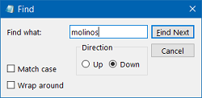

<div style="text-align: center;">

  

  # Notepad PyQt

  ### A Windows Notepad clone built with Python and [PyQt](https://www.riverbankcomputing.com/software/pyqt).


  [Key Features](#key-features) | 
  [How To Use](#how-to-use) |
  [Download](#download) |
  [Dependencies](#dependencies)

  

  A fast and simple Windows Notepad like text editor. Use it to view, edit, and search through plain text documents instantly.

</div>

## Key Features

- __Status Bar__: It is visible at the bottom of the Notepad screen and displays information related to column and line number, current zoom level, end of line character and encoding. The Status Bar itself is enabled by default.

<div style="text-align: center;"> 


</div>

- __Wrap Around__: Earlier, Notepad had certain limitations. For instance, you could only search or replace text using a single word. However, now you can find a new ‘wraparound’ option visible under ‘Find’ tool to search a fragment of a text. Also, Notepad will save previously typed values and checkboxes and automatically apply them when you reopen the ‘Find’ dialog box.

<div style="text-align: center;">



</div>

- __Encoding__: The new Notepad offers slightly changed encodings. So instead of ANSI, the new default encoding is UTF-8. And the new Notepad support UTF-8 without Byte Order Marking. Also, the encoding of the document is now displayed in a new column in the status bar. UTF-8 is sort of more compatible with the web and is becoming a standard these days.

- __Text zooming__: Microsoft has also added options to quickly zoom text in Notepad. So, when you attempt to change the text layout, you can notice the zoom percentage on its status bar. You can alter this until you get the preferred zoom level. Also, you can change Text Zoom Level by simply heading to ‘View’ option, select ‘Zoom’ and choose any of the following options,
  - Zoom In (Control + Plus)
  - Zoom Out (Control + Minus)
  - Restore Default Zoom (Control + 0)

<div style="text-align: center;">


</div>

- __Keyboard Shortcuts__: A wide variety of keyboard shortcuts have been added to Notepad. These shortcuts make the tool easier to use and makes the features more accessible. Here are some of the useful keyboard shortcuts added in this update: 
  - Ctrl+F: Show Find window
  - Ctrl+H: Show Search and Replace window
  - Ctrl+G: Show Go To Line window.

<div style="text-align: center;">


</div>

## How To Use

To clone and run this application, you'll need [Git](https://git-scm.com). From your command line:

```bash
# Clone this repository
$ git clone https://github.com/vitinortiz/notepad-pyqt

# Go into the repository
$ cd notepad-pyqt

# Install dependencies
$ python install -o requirements.txt

# Run the app
$ python notepad.py
```

## Download

You can [download](https://github.com/vitinortiz/notepad-pyqt/releases/tag/latest) the latest installable version of Notpad PyQt for Windows, macOS and Linux.


## Dependencies

<div style="text-align: center;">

  
  
  

</div>

---

> GitHub [@VitinOrtiz](https://github.com/vitinortiz) &nbsp;&middot;&nbsp;
> LinkedIn [@VictorOrtizPR](https://linkedin.com/VictorOrtizPR)
